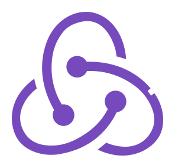
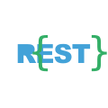
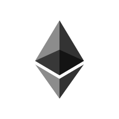
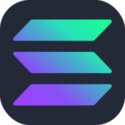
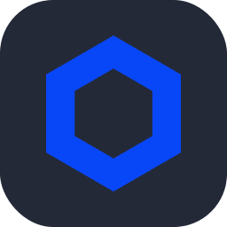
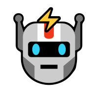
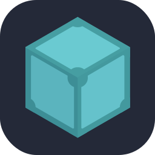
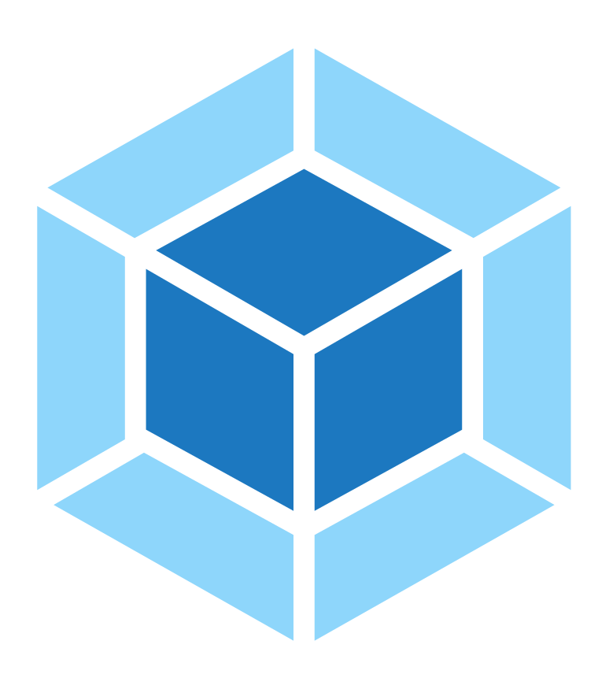
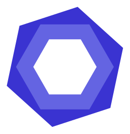

<div align="center" width="50">

<div align="center">
  <a href="https://git.io/typing-svg"></a>
</div>

<picture>
  <source media="(prefers-color-scheme: dark)" srcset="./Skills_Animation_Dark.gif">
  <source media="(prefers-color-scheme: light)" srcset="./Skills_Animation_White.gif">
  
</picture>

<h3 align="left">Key Focus</h3>
<ul align="left">
  <li>AI Saas Platform development + AI Agent + Bittensor </li>
  <li>Highly scalable and robust dapps based on EVM and Solana.</li>
  <li>Blockchain interoperability using cross-chain bridges.</li>
  <li>Trend AI Crypto Agent</li>
  <li>Decentralized crypto trading platforms.</li>
</ul>
  
<h3 align="left">Current Learning</h3>
<ul align="left">
  <li>Deepening my knowledge in cross-chain functionalites.</li>
  <li>Exploring advanced AI models.</li>
  <li>Improving my skills in cloud computing with AWS and Azure.</li>
  <li>Developing extensive AI Experience</li>
</ul>
<br />
<br />
<br />
<br />

<p><strong>
  Freelancing & Working on Superior Crypto & AI
  <br><br> 
  Vibing to : 🎧  
</strong></p>


</div>

<hr></hr>


```dart
class About extends Me {
  const myTools = {
    "ProgramingLanguages" : { "TypeScript", "Python", "Go", "Rust", "Java", "Ruby" },
    "OtherLanguages" : { "HTML", "CSS", "Bash", "Json", "Markdown" },
    "Database" : { "MongoDB", "Sqlite", "Redis", "PostgreSQL" },
    "Editors" : { "Vscode", "Xcode", "Sublime", "Neovim" },
    "Platforms" : { "Mac", "GNU/Linux", "Windows" },
    "OtherTools" : { "Git", "Figma", "Photoshop", "Gimp", "Lightroom" }
  };
}
```

-  &nbsp; I’m currently building **Crypto World**. <br>
- &nbsp;&nbsp;&nbsp; I like exploring **GNU/LINUX**. <br>
- &nbsp;&nbsp; Ask me about **Next, DEX, Solidity, Rust, Dapp, AI agent, or anything**. <br>
- &nbsp;&nbsp;&nbsp;&nbsp;&nbsp;&nbsp;Fun fact: Blockchain's future will be eternal\*\*.<br>

<div align="center" >

**Code Cycle**<br>


&nbsp;&nbsp;&nbsp;&nbsp;&nbsp;

&nbsp;&nbsp;&nbsp;&nbsp;&nbsp;
<br>

<div align="center" width='100%'>
  <h1><a align='center' width='100%' href="#">Please Click Here!</a></h1>
</div>

<table align="center">
  <tr>
    <td align="center" width="90">
      
      <br>HTML5
    </td>
    <td align="center" width="90">
      
      <br>CSS3
    </td>
    <td align="center" width="90">
      
      <br>Javascript
    </td>
    <td align="center" width="90">
      
      <br>Typescript
    </td>
    <td align="center" width="90">
      
      <br>React
    </td>
    <td align="center" width="90">
      
      <br>Next.js
    </td>
    <td align="center" width="90">
      
      <br>React-Native
    </td>
    <td align="center" width="90">
      
      <br>Redux
    </td>
    <td align="center" width="90">
      
      <br>Zustand
    </td>
  </tr>
  <tr>
    <td align="center" width="90">
      
      <br>Recoil
    </td>
    <td align="center" width="90">
      
      <br>Vue
    </td>
    <td align="center" width="90">
      
      <br>Pinia
    </td>
    <td align="center" width="90">
      
      <br>Nuxt.js
    </td>
    <td align="center" width="90">
      
      <br>Angular
    </td>
    <td align="center" width="90">
      
      <br>Gatsby
    </td>
    <td align="center" width="90">
      
      <br>Electron
    </td>
    <td align="center" width="90">
      
      <br>Tauri
    </td>
    <td align="center" width="90">
      
      <br>Node.js
    </td>
  </tr>
  <tr>
    <td align="center" width="90">
      
      <br>Express
    </td>
    <td align="center" width="90">
      
      <br>Nest.js
    </td>
    <td align="center" width="90">
      
      <br>FastAPI
    </td>
    <td align="center" width="90">
      
      <br>Django
    </td>
    <td align="center" width="90">
      
      <br>Flask
    </td>
    <td align="center" width="90">
      
      <br>Python
    </td>
    <td align="center" width="90">
      
      <br>Laravel
    </td>
    <td align="center" width="90">
      
      <br>PHP
    </td>
    <td align="center" width="90">
      
      <br>MongoDB
    </td>
  </tr>
  <tr>
    <td align="center" width="90">
      
      <br>PostgreSQL
    </td>
    <td align="center" width="90">
      
      <br>Firebase
    </td>
    <td align="center" width="90">
      
      <br>Redis
    </td>
    <td align="center" width="90">
      
      <br>MySQL
    </td>
    <td align="center" width="90">
      
      <br>SQLite
    </td>
    <td align="center" width="90">
      
      <br>Supabase
    </td>
    </td>
    <td align="center" width="90">
      
      <br>Mongoose
    </td>
    <td align="center" width="90">
      
      <br>Prisma
    </td>
    <td align="center" width="90">
      
      <br>GraphQL
    </td>
  </tr>
  <tr>
    <td align="center" width="90">
      
      <br>RestAPI
    </td>
    <td align="center" width="90">
      
      <br>Clerk
    </td>
    <td align="center" width="90">
      
      <br>Chatgpt
    </td>
    <td align="center" width="90">
      
      <br>Langchain
    </td>
    <td align="center" width="90">
      
      <br>Pinecone
    </td>
    <td align="center" width="90">
      
      <br>Tailwind CSS
    </td>
    <td align="center" width="90">
      
      <br>SASS
    </td>
    <td align="center" width="90">
      
      <br>Bootstrap
    </td>
    </td>
    <td align="center" width="90">
      
      <br>MUI
    </td>
  </tr>
  <tr>
    <td align="center" width="90">
      
      <br>Antd
    </td>
    <td align="center" width="90">
      
      <br>Styled
    </td>
    <td align="center" width="90">
      
      <br>Framer Motion
    </td>
    <td align="center" width="90">
      
      <br>Three.js
    </td>
    <td align="center" width="90">
      
      <br>Ethereum
    </td>
    <td align="center" width="90">
      
      <br>Solana
    </td>
    <td align="center" width="90">
      
      <br>Chainlink
    </td>
    <td align="center" width="90">
      
      <br>Trading Bot
    </td>
    <td align="center" width="90">
      
      <br>NFT
    </td>
  </tr>
  <tr>
    <td align="center" width="90">
      
      <br>IPFS
    </td>
    <td align="center" width="90">
      
      <br>DeFi
    </td>
    <td align="center" width="90">
      
      <br>Openzeppelin
    </td>
    <td align="center" width="90">
      
      <br>Hardhat
    </td>
    <td align="center" width="90">
      
      <br>Truffle
    </td>
    <td align="center" width="90">
      
      <br>Solidity
    </td>
    <td align="center" width="90">
      
      <br>Storybook
    </td>
    <td align="center" width="90">
      
      <br>Swagger
    </td>
    <td align="center" width="90">
      
      <br>Postman
    </td>
  </tr>
  <tr>
    <td align="center" width="90">
      
      <br>Webpack
    </td>
    <td align="center" width="90">
      
      <br>Vite
    </td>
    <td align="center" width="90">
      
      <br>ESLint
    </td>
    <td align="center" width="90">
      
      <br>Jest
    </td>
    <td align="center" width="90">
      
      <br>Selenium
    </td>
    <td align="center" width="90">
      
      <br>Rust
    </td>
    <td align="center" width="90">
      
      <br>Go
    </td>
    <td align="center" width="90">
      
      <br>Java
    </td>
    <td align="center" width="90">
      
      <br>Docker
    </td>
  </tr>
  <tr>
    <td align="center" width="90">
      
      <br>Kubernetes
    </td>
    <td align="center" width="90">
      
      <br>Vercel
    </td>
    <td align="center" width="90">
      
      <br>Git
    </td>
    <td align="center" width="90">
      
      <br>Github
    </td>
    <td align="center" width="90">
      
      <br>Gitlab
    </td>
    <td align="center" width="90">
      
      <br>Github Actions
    </td>
    <td align="center" width="90">
      
      <br>AWS
    </td>
    <td align="center" width="90">
      
      <br>Nginx
    </td>
    <td align="center" width="90">
      
      <br>Ngrok
    </td>
  </tr>
  <tr>
    <td align="center" width="90">
      
      <br>PM2
    </td>
    <td align="center" width="90">
      
      <br>Kotlin
    </td>
    <td align="center" width="90">
      
      <br>C
    </td>
    <td align="center" width="90">
      
      <br>C++
    </td>
    <td align="center" width="90">
      
      <br>C#
    </td>
    <td align="center" width="90">
      
      <br>Flutter
    </td>
    <td align="center" width="90">
      
      <br>Dart
    </td>
    <td align="center" width="90">
      
      <br>Ruby
    </td>
    <td align="center" width="90">
      
      <br>Rails
    </td>
  </tr>
</table>

</div>
